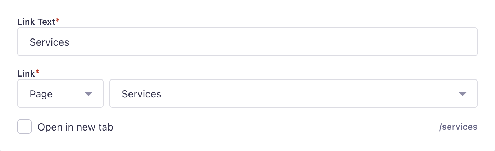

# Strapi Plugin Link Field

A custom field for Strapi that provides link functionality, supporting URLs, file uploads, and content relations.



## Installation

```bash
npm install @fresh.codes/strapi-plugin-link-field
```

## Configuration

Configure content relations and URL templates:

```javascript
// config/plugins.js
module.exports = {
  'link-field': {
    enabled: true,
    config: {
      relations: {
        'api::article.article': {
          urlTemplate: '/articles/{slug}',
        },
        'api::page.page': {
          urlTemplate: '/pages/{slug}',
        },
        'api::product.product': {
          urlTemplate: '/products/{id}',
        },
      },
    },
  },
}
```

Template variables are replaced with actual values from the related content:

- `{id}` → Content ID
- `{slug}` → Content slug
- `{title}` → Content title
- Any other field name from the content

## Data Structure

The link field stores data in the following format:

```typescript
type LinkFieldData = {
  text?: string // Display text for the link
  linkType: 'url' | 'file' | UID.ContentType // Type of link (url, file, or relation key)
  relatedData?: {
    // Related content data or file
    id: number
    url?: string
    title?: string
    name?: string
    slug?: string
    [key: string]: unknown
  }
  openInNewTab?: boolean // Whether to open in new tab
  url?: string
}
```
